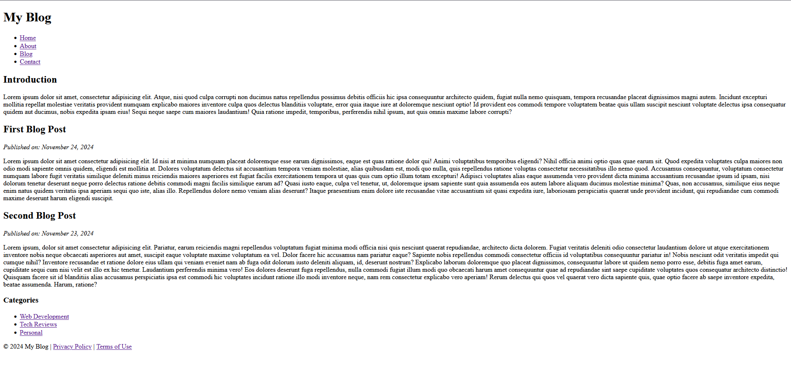
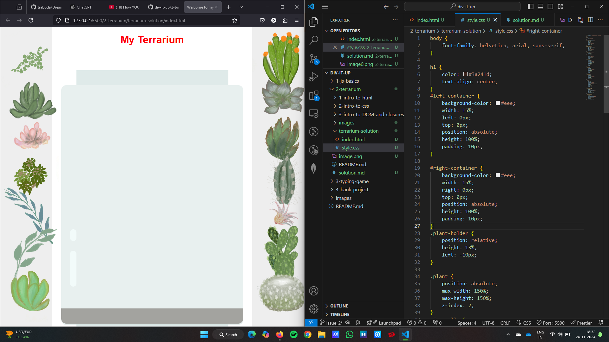
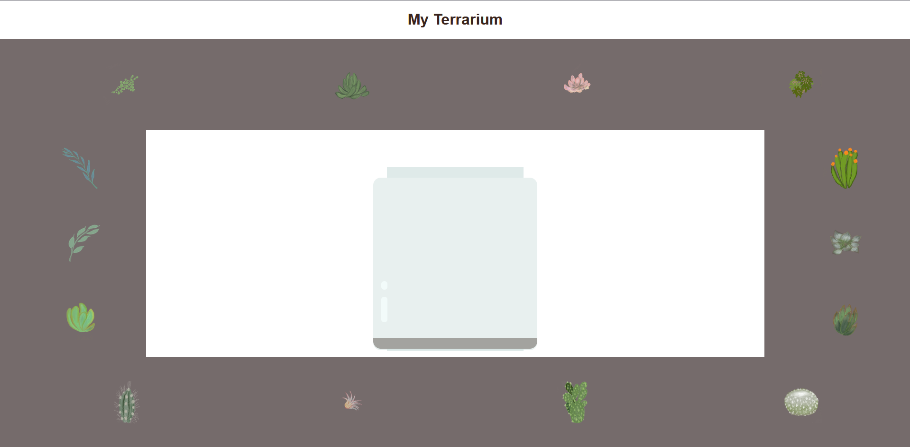
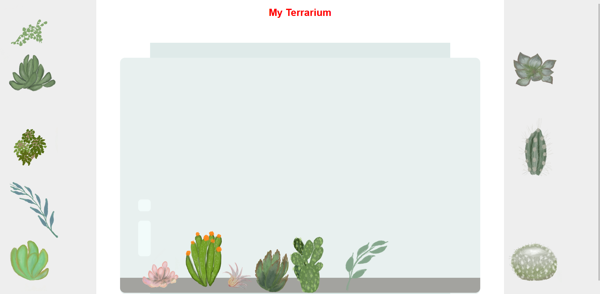
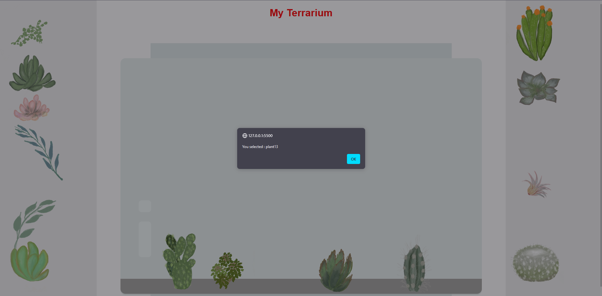

# 2-terrarium
---
---

## Subtopic 1 : 1-intro-to-html

---

### Challenge
There are some wild 'older' tags in HTML that are still fun to play with, though you shouldn't use deprecated tags such as these tags in your markup. Still, can you use the old <marquee> tag to make the h1 title scroll horizontally? (if you do, don't forget to remove it afterwards)
---
Yes, <marquee> tag can be used to make the title scroll horizontally.
There are many other tags like :
- <center> : Displays its block-level or inline contents centered horizontally within its containing element.
- <strike> : Places a strikethrough (horizontal line) over text.
- <xmp>    : Renders text between the start and end tags without interpreting the HTML in between and using a monospaced font. The HTML2 specification recommended that it should be rendered wide enough to allow 80 characters per line.
- <nobr>   : This tag is used to ignore text break

---

### Assignment

#### Grapical Mockup
This is the Image



The html code :
```
<!DOCTYPE html>
<html lang="en">
<head>
  <meta charset="UTF-8">
  <meta name="viewport" content="width=device-width, initial-scale=1.0">
  <title>My Blog</title>
</head>
<body>
  <header>
    <h1>My Blog</h1>
    <nav>
      <ul>
        <li><a href="">Home</a></li>
        <li><a href="">About</a></li>
        <li><a href="">Blog</a></li>
        <li><a href="">Contact</a></li>
      </ul>
    </nav>
  </header>
  <div class="intro">
    <h2>Introduction</h2>
    <p>
        Lorem ipsum dolor sit amet, consectetur adipisicing elit. Atque, nisi quod culpa corrupti non ducimus natus repellendus possimus debitis officiis hic ipsa consequuntur architecto quidem, fugiat nulla nemo quisquam, tempora recusandae placeat dignissimos magni autem. Incidunt excepturi mollitia repellat molestiae veritatis provident numquam explicabo maiores inventore culpa quos delectus blanditiis voluptate, error quia itaque iure at doloremque nesciunt optio! Id provident eos commodi tempore voluptatem beatae quis ullam suscipit nesciunt voluptate delectus ipsa consequatur quidem aut ducimus, nobis expedita ipsam eius! Sequi neque saepe cum maiores laudantium! Quia ratione impedit, temporibus, perferendis nihil ipsum, aut quis omnis maxime labore corrupti?
    </p>
  </div>
  <div class="container">
    <div class="main-content">
      <article>
        <h2>First Blog Post</h2>
        <p><i>Published on: November 24, 2024</i></p>
        <p> Lorem ipsum dolor sit amet consectetur adipisicing elit. Id nisi at minima numquam placeat doloremque esse earum dignissimos, eaque est quas ratione dolor qui! Animi voluptatibus temporibus eligendi? Nihil officia animi optio quas quae earum sit. Quod expedita voluptates culpa maiores non odio modi sapiente omnis quidem, eligendi est mollitia at. Dolores voluptatum delectus sit accusantium tempora veniam molestiae, alias quibusdam est, modi quo nulla, quis repellendus ratione voluptas consectetur necessitatibus illo nemo quod. Accusamus consequuntur, voluptatum consectetur numquam labore fugit veritatis similique deleniti minus reiciendis maiores asperiores est fugiat facilis exercitationem tempora ut quas quis cum optio illum totam excepturi! Adipisci voluptates alias eaque assumenda vero provident dicta minima accusantium recusandae ipsum id ipsam, nisi dolorum tenetur deserunt neque porro delectus ratione debitis commodi magni facilis similique earum ad? Quasi iusto eaque, culpa vel tenetur, ut, doloremque ipsam sapiente sunt quia assumenda eos autem labore aliquam ducimus molestiae minima? Quas, non accusamus, similique eius neque enim natus quidem veritatis ipsa aperiam sequi quo iste, alias illo. Repellendus dolore nemo veniam alias deserunt? Itaque praesentium enim dolore iste recusandae vitae accusantium sit quasi expedita iure, laboriosam perspiciatis quaerat unde provident incidunt, qui repudiandae cum commodi maxime deserunt harum eligendi suscipit.
        </p>
      </article>
      <div>
        <h2>Second Blog Post</h2>
        <p><i>Published on: November 23, 2024</i></p>
        <p>
            Lorem ipsum, dolor sit amet consectetur adipisicing elit. Pariatur, earum reiciendis magni repellendus voluptatum fugiat minima modi officia nisi quis nesciunt quaerat repudiandae, architecto dicta dolorem. Fugiat veritatis deleniti odio consectetur laudantium dolore ut atque exercitationem inventore nobis neque obcaecati asperiores aut amet, suscipit eaque voluptate maxime voluptatum ea vel. Dolor facere hic accusamus nam pariatur eaque? Sapiente nobis repellendus commodi consectetur officiis id voluptatibus consequuntur pariatur in! Nobis nesciunt odit veritatis impedit qui cumque nihil? Inventore recusandae et ratione dolore eius ullam qui veniam eveniet nam ab fuga odit dolorum iusto deleniti aliquam, id, deserunt nostrum? Explicabo laborum doloremque quo placeat dignissimos, consequuntur labore ut quidem nemo porro esse, debitis fuga amet earum, cupiditate sequi cum nisi velit est illo ex hic tenetur. Laudantium perferendis minima vero! Eos dolores deserunt fuga repellendus, nulla commodi fugiat illum modi quo obcaecati harum amet consequuntur quae ad repudiandae sint saepe cupiditate voluptates quos consequatur architecto distinctio! Quisquam facere sit id blanditiis alias accusamus perspiciatis ipsa est commodi hic voluptates incidunt ratione illo modi inventore neque, nam rem consectetur explicabo vero aperiam! Rerum delectus qui quos vel quaerat vero dicta sapiente quis, quae optio facere ab saepe inventore expedita, beatae assumenda. Harum, ratione?
        </p>
      </article>
    </div>
    <div class="sidebar">
      <h3>Categories</h3>
      <ul>
        <li><a href="">Web Development</a></li>
        <li><a href="">Tech Reviews</a></li>
        <li><a href="">Personal</a></li>
      </ul>
    </div>
  </div>
  <footer>
    <p>&copy; 2024 My Blog | <a href=" ">Privacy Policy</a> | <a href=" ">Terms of Use</a></p>
  </footer>
</body>
</html>
```

---
---

## Subtopic 2 : 2-intro-to-css

---

### Challenge 
- To the given CSS, Added a 'bubble' shine using the following css:
    ```
    .jar-glossy-long{
        left:5%;
        top: 69%;
        background-color: #e6f8f5;
        position: absolute;
        width:3.5%;
        height:15%;
        border-radius: 10px;
    }

    .jar-glossy-short{
        left:5%;
        top: 60%;
        background-color: #e6f8f5;
        position: absolute;
        width:3.5%;
        height:5%;
        border-radius: 10px;
    }
    ```
- The full code is present in terrarium-solution.


---

### Assignment 

- Changed the index.html and style.css by adding flexbox and changed the desing a little bit. 


HTML
```
<!DOCTYPE html>
<html lang="en">
<head>
    <meta charset="UTF-8">
    <meta name="viewport" content="width=device-width, initial-scale=1.0">
    <meta http-equiv="X-UA-Compatible" content="IE=edge" />
    <title>Welcome to my Virtual Terrarium</title>
    <link rel="stylesheet" href="./style.css" />
</head>
<body>
    <h1>My Terrarium</h1>
    <div id="page">
        <div id="top-container" class="container">
            <div class="plant-holder">
                
            </div>
            <div class="plant-holder">
                
            </div>
            <div class="plant-holder">
                
            </div>
            <div class="plant-holder">
                
            </div>
        </div>

        <div id="main-container">
            <div id="left-container" class="container">
                <div class="plant-holder">
                    
                </div>
                <div class="plant-holder">
                    
                </div>
                <div class="plant-holder">
                    
                </div>
            </div>

            <div id="terrarium">
                <div class="jar-top"></div>
                <div class="jar-walls">
                    <div class="jar-glossy-long"></div>
                    <div class="jar-glossy-short"></div>
                </div>
                <div class="dirt"></div>
                <div class="jar-bottom"></div>
            </div>

            <div id="right-container" class="container">
                <div class="plant-holder">
                    
                </div>
                <div class="plant-holder">
                    
                </div>
                <div class="plant-holder">
                    
                </div>
            </div>
        </div>

        <div id="bottom-container" class="container">
            <div class="plant-holder">
                
            </div>
            <div class="plant-holder">
                
            </div>
            <div class="plant-holder">
                
            </div>
            <div class="plant-holder">
                
            </div>
        </div>
    </div>
</body>
</html>
```
CSS with FlexBox
```
body {
    font-family: helvetica, arial, sans-serif;
    display: flex;
    flex-direction: column;
    margin: 0;
    height: 100vh;
    align-items: center;
}
  
h1 {
    color: #3a241d;
    text-align: center;
}
  
#page {
    display: flex;
    flex-direction: column;
    width: 100%;
    height: 100%;
}
.container {
    display: flex;
    justify-content: space-around;
    align-items: center;
    background-color: #756b6b;
    padding: 10px;
}
  
#top-container,
#bottom-container {
    height: 20%;
}
  
#main-container {
    display: flex;
    flex: 1;
    align-items: center;
    justify-content: space-between;
}
  
#left-container,
#right-container {
    display: flex;
    flex-direction: column;
    justify-content: space-around;
    align-items: center;
    width: 15%;
    background-color: #756b6b;
    padding: 10px;
    height: 100%;
}
  
#terrarium {
    position: relative;
    width: 30%;
    height: 95%;
    background: transparent;
}
.plant-holder {
    position: relative;
    height: 90px;
    width: 60px;
}
  
.plant {
    max-width: 150%;
    max-height: 150%;
    z-index: 2;
}
  
.jar-walls {
    height: 80%;
    width: 60%;
    background: #d1e1df;
    border-radius: 1rem;
    position: absolute;
    bottom: 0.5%;
    left: 20%;
    opacity: 0.5;
    z-index: 1;
}
  
.jar-top {
    width: 50%;
    height: 5%;
    background: #d1e1df;
    position: absolute;
    bottom: 80.5%;
    left: 25%;
    opacity: 0.7;
    z-index: 1;
}
  
.jar-bottom {
    width: 50%;
    height: 1%;
    background: #d1e1df;
    position: absolute;
    bottom: 0%;
    left: 25%;
    opacity: 0.7;
}
  
.dirt {
    width: 60%;
    height: 5%;
    background: #3a241d;
    position: absolute;
    border-radius: 0 0 1rem 1rem;
    bottom: 1%;
    left: 20%;
    opacity: 0.7;
    z-index: -1;
}
  
.jar-glossy-long {
    left: 5%;
    top: 69%;
    background-color: #e6f8f5;
    position: absolute;
    width: 3.5%;
    height: 15%;
    border-radius: 10px;
}
.jar-glossy-short {
    left: 5%;
    top: 60%;
    background-color: #e6f8f5;
    position: absolute;
    width: 3.5%;
    height: 5%;
    border-radius: 10px;
}
```

---

## Subtopic 3 : 3-intro-to-DOM-and-closures
---
Added the script.js file. 


### Challenge
Add new event handler to your closure to do something more to the plants; for example, double-click a plant to bring it to the front. Get creative!

---
I added a double click event, which shows the plant which you have double clicked on.
```
terrariumElement.ondblclick = () => {
        alert(`You selected : ${terrariumElement.id}`);
    };
```


---

### Assignment
Research the DOM a little more by 'adopting' a DOM element. Visit the MDN's list of DOM interfaces and pick one. Find it being used on a web site in the web, and write an explanation of how it is used.
---
I researched a little more on `Event`.
- An event can be triggered by any action from the user. It can be anything from even Hovering the mouse pointer on any element. 
- Event-handlers are usually connected to various HTML like `<button>`, `<div>`, `<span>`, etc.
- About where it is used in web sites, I personally don't think there are websites in today's date where events aren't used. Every activity we do like clicking on a link, Searching for something, Entering our search, all triggers an Event.  