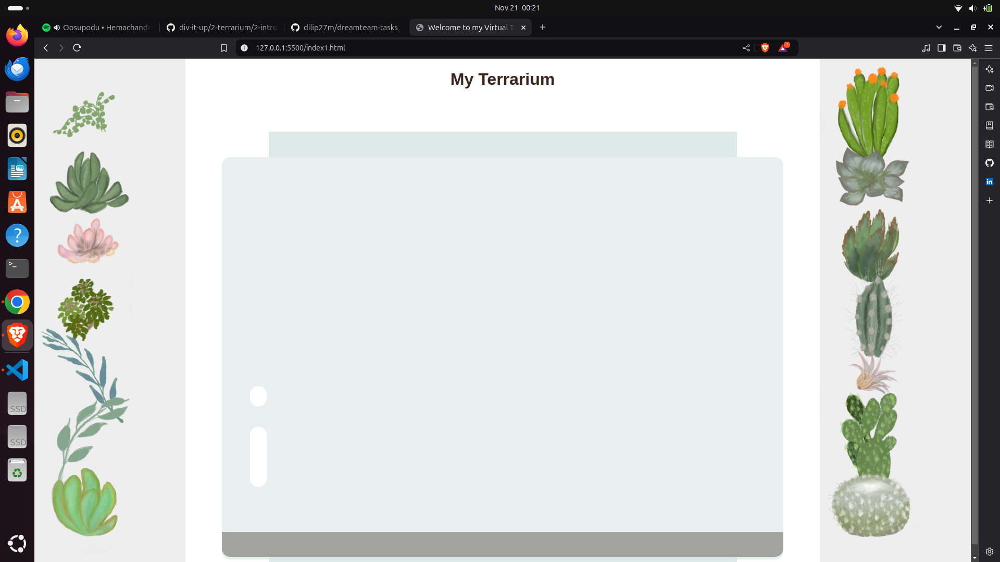

# Issue2

---

## Sub Topic-1

### Assignment


```


<!DOCTYPE html>
<html lang="en">
<head>
    <meta charset="UTF-8">
    <meta name="viewport" content="width=device-width, initial-scale=1.0">
    <title>Portfolio</title>
    <style>
        body {
            background-color:black;
            color: white;
        }
        header {
            background:black;
            color: white;
            padding: 10px 20px;
            text-align: center;
        }
        header nav a {
            color: white;
            margin: 0 15px;
        }
        .profile {
            text-align: center;
            padding: 50px 20px;
            background: black;
        }
        .profile img {
            border-radius: 50%;
            width: 150px;
            height: 150px;
        }
        .space{
            padding: 20px;
        }
        .projects {
            display: flex;
            flex-wrap: wrap;
            justify-content: space-around;
        }
        .projects div {
            background: black;
            margin: 10px;
            padding: 15px;
            text-align: center;
            border: 1px solid white;
            width: 30%;
        }
        footer {
            background: black;
            color:gold;
            text-align: center;
            padding: 10px 0;
        }
        footer a {
            color: white;
            margin: 0 10px;
        }
    </style>
</head>
<body>
    <header>
        <h1>Dilip</h1>
        <nav>
            <a href="#about">About</a>
            <a href="#projects">Projects</a>
            <a href="#contact">Contact</a>
            <a href="#blogs">Blogs</a>
        </nav>
    </header>

    <div class="profile">
        
        <h2>Hi, I'm dilip. I'm a Software development entuast</h2>
        <a href="#about">Learn More</a>
    </div>

    <div id="about" class="space">
        <h2>About Me</h2>
        <p>
           I'm M Dilip kumar reddy Currently studing in Amrita vishwa vidyapeetham <br>
           Btech in computer science field ,I'm intereseted in developing technology.
        </p>
    </div>

    <div id="projects" class="space">
        <h2>My Projects</h2>
        <div class="projects">
            <div>
                <h3>Project 1</h3>
                <p>will be updated soon .....</p>
            </div>
            <div>
                <h3>Project 2</h3>
                <p>will be updated soon .....</p>
            </div>
            <div>
                <h3>Project 3</h3>
                <p>will be updated soon .....</p>
            </div>
        </div>
    </div>

    <div id="blogs" class="space">
        <h2>Blogs</h2>
        <p>Will be posted soon ....</p>
    </div>

    <footer>
        <p>
            <a href="https://github.com/">GitHub</a> |
            <a href="https://linkedin.com/">LinkedIn</a> 
        </p>
    </footer>
</body>
</html>
```


## Sub Topic-2

### Challenge
```
.jar-glossy-long{
    background-color: white;
    top: 60%;
    height:15%;
    position: absolute;
    width:3%;
    margin: 5%;
    border-radius: 50px;
}

.jar-glossy-short{
    background-color: white;
    height:5%;
    position: absolute;
    width:3%;
    margin: 5%;
    border-radius: 50px;
    top: 50%;
}
```
### Assignment
#### Chrome browser

#### Brave browser

#### Fire Fox browser


### code using CSS Grid

```
html code
<!DOCTYPE html>
<html>
<head>
    <title>Welcome to my Virtual Terrarium</title>
    <meta charset="utf-8" />
    <meta name="viewport" content="width=device-width, initial-scale=1" />
    <link rel="stylesheet" href="style.css" />
</head>
<body>
    <div id="terrarium-app">
        <header>
            <h1>My Terrarium</h1>
        </header>
        <main>
            <div id="left-container" class="container">
                <div class="plant-holder">
                    
                </div>
                <div class="plant-holder">
                    
                </div>
                <div class="plant-holder">
                    
                </div>
                <div class="plant-holder">
                    
                </div>
                <div class="plant-holder">
                    
                </div>
                <div class="plant-holder">
                    
                </div>
                <div class="plant-holder">
                    
                </div>               
                
            </div>
            <div id="terrarium">
                <div class="jar-top"></div>
                <div class="jar-walls">
                    <div class="jar-glossy-long"></div>
                    <div class="jar-glossy-short"></div>
                </div>
                <div class="dirt"></div>
                <div class="jar-bottom"></div>
            </div>
            <div id="right-container" class="container">
                <div class="plant-holder">
                    
                </div>
                <div class="plant-holder">
                    
                </div>
                <div class="plant-holder">
                    
                </div>
                <div class="plant-holder">
                    
                </div>
                <div class="plant-holder">
                    
                </div>
                <div class="plant-holder">
                    
                </div>
                <div class="plant-holder">
                    
                </div>                
                
            </div>
        </main>
    </div>
</body>
</html>
```
```
style.css

body {
    font-family: Arial, sans-serif;
    margin: 0;
    padding: 0;
    display: flex;
    justify-content: center;
    align-items: center;
    height: 100vh;
    background-color: #f4f4f4;
}

#terrarium-app {
    display: grid;
    grid-template-rows: auto 1fr;
    grid-template-columns: 15% auto 15%;
    gap: 1rem;
    width: 100%;
    max-width: 1200px;
    height: 90vh;
}

header {
    grid-column: 1 / -1;
    text-align: center;
    background: #eee;
    padding: 1rem;
}

h1 {
    margin: 0;
    color: #3a241d;
}

main {
    display: grid;
    grid-template-columns: 1fr 2fr 1fr;
    gap: 1rem;
    height: 100%;
}

.container {
    display: grid;
    grid-template-rows: repeat(7, 1fr);
    gap: 0.5rem;
    background-color: #eee;
    padding: 0.5rem;
    overflow-y: auto;
    border-radius: 0.5rem;
}

.plant-holder {
    display: flex;
    justify-content: center;
    align-items: center;
    border: 1px dashed #ccc;
    height: 100%;
}

.plant {
    max-width: 100%;
    max-height: 100%;
}


#terrarium {
    display: flex;
    justify-content: center;
    align-items: flex-end;
    position: relative;
    background: linear-gradient(to top, #d1e1df, #ffffff);
    border-radius: 10px;
    padding: 1rem;
}

.jar-walls {
    position: absolute;
    bottom: 10%;
    width: 60%;
    height: 70%;
    background: #d1e1df;
    opacity: 0.5;
    border-radius: 1rem;
}

.jar-top {
    position: absolute;
    width: 50%;
    height: 3%;
    background: #d1e1df;
    opacity: 0.7;
    border-radius: 0.5rem;
    top: 20%;
}

.jar-bottom {
    position: absolute;
    width: 50%;
    height: 2%;
    background: #d1e1df;
    bottom: 0;
    border-radius: 0 0 1rem 1rem;
}

.dirt {
    position: absolute;
    width: 60%;
    height: 5%;
    background: #3a241d;
    border-radius: 0 0 1rem 1rem;
    bottom: 5%;
}


.jar-glossy-long {
    position: absolute;
    background-color: white;
    width: 3%;
    height: 15%;
    top: 25%;
    left: 10%;
    border-radius: 50px;
}

.jar-glossy-short {
    position: absolute;
    background-color: white;
    width: 3%;
    height: 5%;
    top: 40%;
    left: 20%;
    border-radius: 50px;
}
```

## Sub Topic-3

### Challenge
```

    terrariumElement.ondblclick = bringToFront;

    function bringToFront() {
		zIndexCounter++; 
		terrariumElement.style.zIndex = zIndexCounter; 
	}
``` 
### Assignment


```
I choose Event interface

 submit the event is triggered when when we submit a form ,we can validate the form data on client side it self also


<form id="form">
  <label for="username">Username:</label>
  <input type="text" id="username" required />
  <button type="submit">Submit</button>
</form>

<script>
  document.getElementById('form').addEventListener('submit', function (event) {
    const username = document.getElementById('username').value;

    if (!username.trim()) {
      alert('enter username');
      event.preventDefault(); 
    } else {
      alert('Form submitted successfully!');
    }
  });
</script>


`reset` is used when we click reset in forms
same as submit it clears entire forms data we entered 


`focus` on an element ,such as setting the cursor in a input form when the page is loaded

`blur` is used to blur the data when the field is out of focus


`click` is triggered when user clicks on particular element.In web we use it as a button do this when click 

`dbclick` this is triggered when the user double clicks an element .In this example for dbclick we bring the element to front

`mousedown` this is triggered when the mouse button is clicked down.In web selecting an text or highlighting there are many examples

`mouseup` opposite to mousedown when it is released.

`mouseover` when the mouse pointer an element .In web like toogle option

`mouseout` opposite do this when mouse is not pointing 
we can do blur by this also ,when the mouseout we call blur event 

`drag` triggered when an element is being dragged

`load` event invokes when the page is loading.

`resize` triggered when the browser window is resized

`scroll` triggered when the document is scrolled

```
