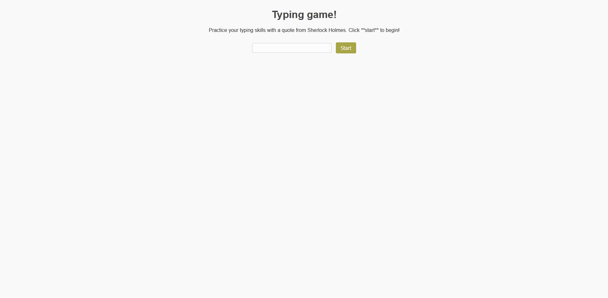
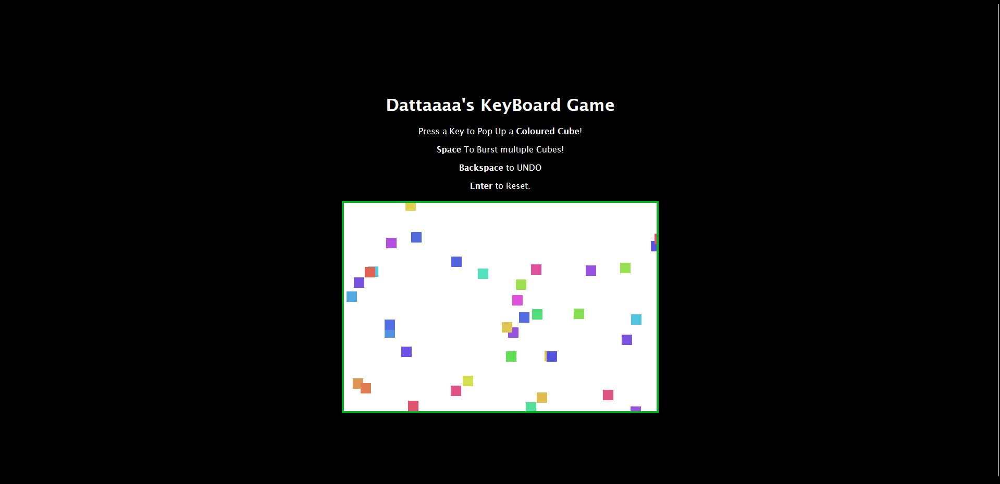

# 3-typing-game

---
---

- First of all, created the basic typing game from the given code.
- Added a little CSS to make it look better. 


---
### Challenge

- Disabled the input event listener along with the textbox by `typedValueElement.disabled = true;`
- To display a modal dialogue box, and also store the highscores using localStorage, I added these.
- HTML:
    ```
    <div id="modal" class="modal">
        <div class="modal-content">
            <p id="modal-message"></p>
            <button id="close-modal">Close</button>
        </div>
    </div>
    ```
- JavaScript:
    ```
    const modal = document.getElementById('modal');
    const modalMsg = document.getElementById('modal-message');
    const close = document.getElementById('close-modal');
    ```
    In the input event listener, I added,
    ```
    showModal(message);
    ```
    And created functions
    ```
    function showModal(message) {
        modalMsg.innerText = message;
        modal.style.display = 'flex';
    }
    close.addEventListener('click', () => {
        modal.style.display = 'none';
    });
    ```

---

### Assignment

I created a very simple game, when there is a canvas box.
- When you press a key, a cube with a colour pops up on the canvas.
- Backspace will remove the previous cube.
- Spacebar will add multiple cubes.\
- Enter will clear the canvas.

You can see the Image 

The files are .