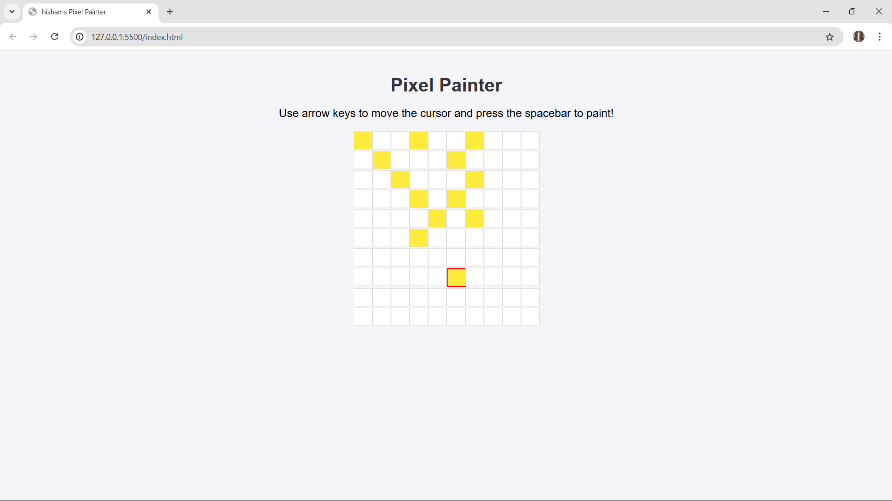

# 3-typing-game

## my-typing game:

index.html
```
<!DOCTYPE html>
<html lang="en">
<head>
  <meta charset="UTF-8">
  <meta name="viewport" content="width=device-width, initial-scale=1.0">
  <title>Typing Game</title>
  <link rel="stylesheet" href="style.css">
</head>
<body>
  <h1>Typing Game!</h1>
  <p>Practice your typing skills with a quote from Sherlock Holmes. Click <strong>Start</strong> to begin!</p>
  <p id="quote"></p> <!-- Displays the quote -->
  <p id="message"></p> <!-- Displays the status messages -->
  <div>
    <input type="text" aria-label="current word" id="typed-value" /> <!-- Textbox for typing -->
    <button type="button" id="start">Start</button> <!-- Start button -->
  </div>
  <script src="script.js"></script>
</body>
</html>
```
style.css
```
body {
    font-family: Arial, sans-serif;
    text-align: center;
    margin: 0;
    padding: 20px;
    background-color: #f4f4f9;
  }
  
  h1 {
    color: #333;
  }
  
  p {
    font-size: 1.2em;
    margin: 10px 0;
  }
  
  #quote {
    font-size: 1.5em;
    font-weight: bold;
    margin: 20px auto;
    max-width: 600px;
    line-height: 1.6;
    text-align: justify;
  }
  
  .highlight {
    background-color: yellow;
  }
  
  .error {
    background-color: lightcoral;
    border: 2px solid red;
  }
  
  input[type="text"] {
    font-size: 1em;
    padding: 10px;
    margin-right: 10px;
  }
  
  button {
    padding: 10px 15px;
    font-size: 1em;
    background-color: #007bff;
    color: #fff;
    border: none;
    cursor: pointer;
  }
  
  button:hover {
    background-color: #0056b3;
  }
```
script.js
```// inside script.js
// all of our quotes
const quotes = [
    'When you have eliminated the impossible, whatever remains, however improbable, must be the truth.',
    'There is nothing more deceptive than an obvious fact.',
    'I ought to know by this time that when a fact appears to be opposed to a long train of deductions it invariably proves to be capable of bearing some other interpretation.',
    'I never make exceptions. An exception disproves the rule.',
    'What one man can invent another can discover.',
    'Nothing clears up a case so much as stating it to another person.',
    'Education never ends, Watson. It is a series of lessons, with the greatest for the last.',
];
// store the list of words and the index of the word the player is currently typing
let words = [];
let wordIndex = 0;
// the starting time
let startTime = Date.now();
// page elements
const quoteElement = document.getElementById('quote');
const messageElement = document.getElementById('message');
const typedValueElement = document.getElementById('typed-value');

// at the end of script.js
document.getElementById('start').addEventListener('click', () => {
    // get a quote
    const quoteIndex = Math.floor(Math.random() * quotes.length);
    const quote = quotes[quoteIndex];
    // Put the quote into an array of words
    words = quote.split(' ');
    // reset the word index for tracking
    wordIndex = 0;
  
    // UI updates
    // Create an array of span elements so we can set a class
    const spanWords = words.map(function(word) { return `<span>${word} </span>`});
    // Convert into string and set as innerHTML on quote display
    quoteElement.innerHTML = spanWords.join('');
    // Highlight the first word
    quoteElement.childNodes[0].className = 'highlight';
    // Clear any prior messages
    messageElement.innerText = '';
  
    // Setup the textbox
    // Clear the textbox
    typedValueElement.value = '';
    // set focus
    typedValueElement.focus();
    // set the event handler
  
    // Start the timer
    startTime = new Date().getTime();
  });

  // at the end of script.js
typedValueElement.addEventListener('input', () => {
    // Get the current word
    const currentWord = words[wordIndex];
    // get the current value
    const typedValue = typedValueElement.value;
  
    if (typedValue === currentWord && wordIndex === words.length - 1) {
      // end of sentence
      // Display success
      const elapsedTime = new Date().getTime() - startTime;
      const message = `CONGRATULATIONS! You finished in ${elapsedTime / 1000} seconds.`;
      messageElement.innerText = message;
    } else if (typedValue.endsWith(' ') && typedValue.trim() === currentWord) {
      // end of word
      // clear the typedValueElement for the new word
      typedValueElement.value = '';
      // move to the next word
      wordIndex++;
      // reset the class name for all elements in quote
      for (const wordElement of quoteElement.childNodes) {
        wordElement.className = '';
      }
      // highlight the new word
      quoteElement.childNodes[wordIndex].className = 'highlight';
    } else if (currentWord.startsWith(typedValue)) {
      // currently correct
      // highlight the next word
      typedValueElement.className = '';
    } else {
      // error state
      typedValueElement.className = 'error';
    }
  });
  ```

## Assignment
Instructions:
Create a small game that uses keyboard events to do tasks. It may be a different kind of typing game, or an art type game that paints pixels to the screen on keystrokes. Get creative! Try to implement concepts that you have learnt in this topic.

Solution:



index.html
```<!DOCTYPE html>
<html lang="en">
<head>
  <meta charset="UTF-8">
  <meta name="viewport" content="width=device-width, initial-scale=1.0">
  <title>hishams Pixel Painter</title>
  <link rel="stylesheet" href="style.css">
</head>
<body>
  <h1>Pixel Painter</h1>
  <p>Use arrow keys to move the cursor and press the spacebar to paint!</p>
  <div class="grid" id="grid"></div>
  <script src="script.js"></script>
</body>
</html>
```
style.css
```
body {
    font-family: Arial, sans-serif;
    text-align: center;
    background-color: #f4f4f9;
    margin: 0;
    padding: 20px;
  }
  
  h1 {
    color: #333;
    margin-bottom: 10px;
  }
  
  p {
    font-size: 1.2em;
  }
  
  .grid {
    display: grid;
    grid-template-columns: repeat(10, 30px);
    grid-gap: 2px;
    margin: 20px auto;
    width: fit-content;
  }
  
  .cell {
    width: 30px;
    height: 30px;
    background-color: white;
    border: 1px solid #ddd;
  }
  
  .cursor {
    border: 2px solid red;
  }
  
  .painted {
    background-color: #ffeb3b;
  }
  ```

  script.js
  ```const grid = document.getElementById('grid');

// Create a 10x10 grid
for (let i = 0; i < 100; i++) {
  const cell = document.createElement('div');
  cell.classList.add('cell');
  grid.appendChild(cell);
}

// Initialize cursor position
let cursorX = 0;
let cursorY = 0;

// Helper function to get cell index
const getCellIndex = (x, y) => y * 10 + x;

// Get all cells
const cells = document.querySelectorAll('.cell');

// Add initial cursor
cells[getCellIndex(cursorX, cursorY)].classList.add('cursor');

// Event listener for keyboard events
document.addEventListener('keydown', (e) => {
  // Remove the cursor class from the current cell
  cells[getCellIndex(cursorX, cursorY)].classList.remove('cursor');

  // Move the cursor based on keypress
  if (e.key === 'ArrowUp' && cursorY > 0) cursorY--;
  if (e.key === 'ArrowDown' && cursorY < 9) cursorY++;
  if (e.key === 'ArrowLeft' && cursorX > 0) cursorX--;
  if (e.key === 'ArrowRight' && cursorX < 9) cursorX++;

  // Paint the cell if spacebar is pressed
  if (e.key === ' ') {
    cells[getCellIndex(cursorX, cursorY)].classList.add('painted');
  }

  // Clear the grid if 'C' is pressed
  if (e.key.toLowerCase() === 'c') {
    cells.forEach(cell => cell.classList.remove('painted'));
  }

  // Add the cursor class to the new cell
  cells[getCellIndex(cursorX, cursorY)].classList.add('cursor');
});
```


  


