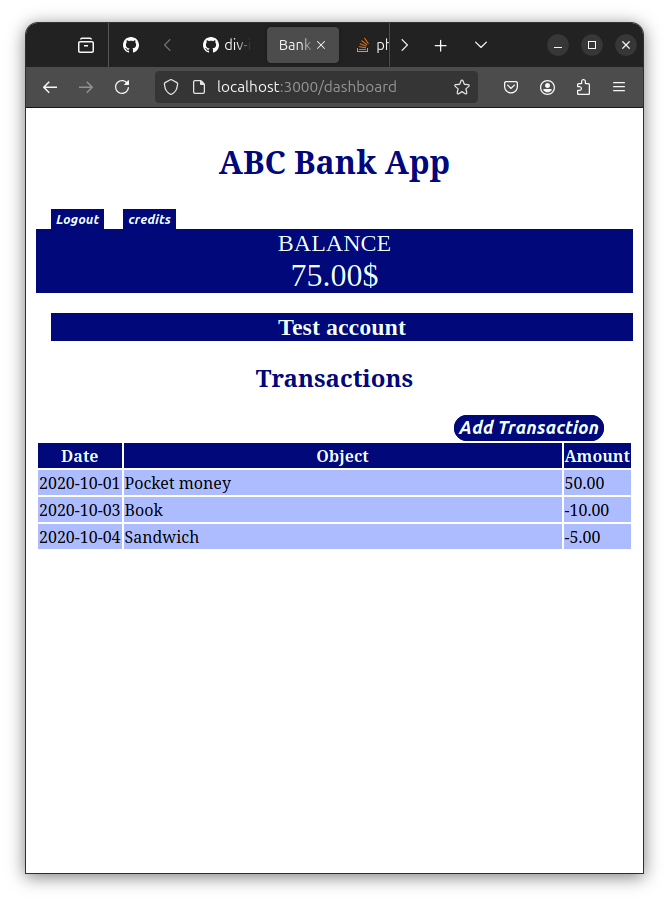

# challenge
##css
```
body{
    margin: 10px;
}
.loginsection{
    display:flex;
    flex-flow: column;
    align-items: center;
}
#loginForm{
    display:flex;
    flex-flow: column;
    row-gap: 20px;
}
#registerForm{
    display:flex;
    flex-flow: column;
    row-gap: 20px;
}
.inputbox{
    width:450px;
    height: 30px;
    border-radius: 1em 1em 1em 1em;
}
.keys{
    width:450px;
    height: 30px;
    color:azure;
    background-color: rgb(0, 8, 122);
    font-size: medium;
    font-weight: 400;
    border-radius: 1em 1em 1em 1em;
}
.heading{
    color: rgb(0, 8, 122);
    text-align: center;
}
.writing{
    font-family: Calibri;
    font-style: oblique;
    font-size: small;
}
.image{
    display: flex;
    justify-content: center;
    color:rgb(0, 8, 122);
}
.usererror{
    color:red;
    font-size: small;
    font-style: oblique;
    font-weight: 600;
}
.contents{
    background-color: rgb(0, 8, 122);
    color: azure;
    font-size: x-large;
    font-family: 'Times New Roman', Times, serif;
    text-align: center;
#balance,#currency{
    font-size: xx-large;
}
}
.completetable{
    width:100%;
    border:1px white;
}
.tablehead{
    background-color: rgb(0, 8, 122);
    color: azure;
}
.tabletopic{
    width:10%;
}
.tablebody{
    background-color: rgb(173, 188, 255);
    color:black;
}
.buttons{
    background-color: rgb(0, 8, 122);
    color: azure;
    font-style: oblique;
    font-size: small;
    font-weight: 800;
    text-align: left;
    margin-left: 15px;
    border: 1px solid rgb(0, 8, 122);
}
.inputbutton{
    background-color: rgb(0, 8, 122);
    color: azure;
    font-style: oblique;
    font-size: large;
    font-weight: 800;
    margin-left: 70%;
    border: 1px solid rgb(0, 8, 122);
    border-radius: 1em 1em 1em 1em;
}
.highlight{
    text-align: center;
    color:azure;
    background-color: rgb(0, 8, 122);
    margin-left: 15px;
    font-size: x-large;
    font-family: 'Times New Roman', Times, serif;
}
@media only screen and (orientation: landscape) {
    .highlight{
        text-align: left;
        color:rgb(0, 8, 122);
        background-color:azure;
    }
}
```
## image



# assignment
## javascript
```
let account = null;// creates a variable with global scope and no value.
const routes = {
  '/login': { templateId: 'login' },
  '/dashboard': { templateId: 'dashboard', init: updateDashboard },
  '/credits':{templateId: 'credit'},
  }; // map the path to its corresponding template along with the function to execute when called.


//**  Navigation of website. **

function updateRoute() {
    const path = window.location.pathname;//return the path section of the URL initiated by the user.
    const route = routes[path];// finds the route according to the path.
    if (!route) { // return back to login if route is not found in the routes.
        return navigate('/login');
    }

    if (path === "/login"){// change the title of the webpage.
      document.title = "Bank app login";
    }
    else if(path === "/dashboard"){// change the title of the webpage.
      document.title = "Bank app Dashboard";
      console.log("Dashboard is shown");
    }
    else if(path === "/credits"){// change the title of the webpage.
      document.title = "Bank app Credit";
    }
    const template = document.getElementById(route.templateId);// retrieve the html template element in the DOM.
    const view = template.content.cloneNode(true);// creates a clone of the template.
    const app = document.getElementById('app');// retrieve the html element.
    app.innerHTML = '';// clears all information from the html element.
    app.appendChild(view);// attach the clone in a visible html element in the DOM.
    if (typeof route.init === 'function') {// executes the function specified in the init variable in the route(if any).
      route.init();
    }
}

function navigate(path) {
  window.history.pushState({}, path, path);// changes the template according to the given path by changing the existing path without reloading the HTML.
  updateRoute();// runs the updateRoute().
}

function logout(){// use the navigate function to change the template to the login template.
  navigate("/login");
}

function credits(){// use the navigate function to change the template to the credits template.
  navigate("/credits");
}

function dashboard(){// use the navigate function to change the template to the dashboard template.
  navigate("/dashboard");
}

window.onpopstate = () => updateRoute();// It is responsible for the working of the forward and backward button to move between saved history.
updateRoute();


//** modifying the html element **

function updateElement(id, textOrNode) {// changes the content of an html element to textOrNode
  const element = document.getElementById(id);
  element.textContent = ''; // Removes all children
  element.append(textOrNode);// change the text or node to the textOrNode.
}


//** registering, logging in , account accessing and account creation. **

async function register() {
  const registerForm = document.getElementById('registerForm');
  const formData = new FormData(registerForm);// retrieves the key-value pair value form the registerForm.
  const jsonData = JSON.stringify(Object.fromEntries(formData));// converts the value into an object and serialize the data to JSON.
  const result = await sendrequest('creates',jsonData);// wait till the createAccount() returns the value.

  if (result.error) {// it shows error if the function doesn't return value.
    return updateElement("uerror",result.error);
    return console.log('An error occurred:', result.error);//displays the message in the console of the browser.
  }
  console.log('Account created!', result);
  account = result;// if no errors occur the account's values are changed to the values of result.
  navigate('/dashboard');
}

async function sendrequest(action,account){
  try{
    if(action === "creates"){
    const response = await fetch('//localhost:5000/api/accounts', {// waits till fetch API requests the server for data.
      method: 'POST',
      headers: { 'Content-Type': 'application/json' },
      body: account});}
    else if(action === "gets"){
      const respon = await fetch('//localhost:5000/api/accounts/' + encodeURIComponent(account));// waits while the fetch API requests for data from the server.
      return await respon.json();}// waits till the json() parses the json file into a javascript object.
  }catch (error) {
    return { error: error.message || 'Unknown error' };// returns error if any await function returns error.
  }
};

async function login() {
  const loginForm = document.getElementById('loginForm')
  const user = loginForm.user.value;// retrieves the value of the user input from the form.
  const data = await sendrequest('gets',user);// wait till the getAccount return a value.

  if (data.error) {
    return updateElement('loginError', data.error);
    return console.log('loginError', data.error);
  }

  account = data;// if no errors ,account's value changes to the data's value.
  navigate('/dashboard');
}


//** content updation in the dashboard(mostly table) **

function updateDashboard() {
  if (!account) {// goes back to the login page if account is not found.
    return navigate('/login');
  }

  updateElement('description', account.description);// it returns the value of description from the account to the html element with id description.
  updateElement('balance', account.balance.toFixed(2));// returns the balance amount with 2 decimal digits to the html element with id balance.
  updateElement('currency', account.currency);// returns currency value to the html element with id currency.
  const transactionsRows = document.createDocumentFragment();// a new DOM fragment on which work can be done before attaching to the HTML table.
  for (const transaction of account.transactions) {// take one value at a time from the account.
    const transactionRow = createTransactionRow(transaction);// stores the value returned from the function.
    transactionsRows.appendChild(transactionRow);// makes a child node within the DOM fragment.
  }
  updateElement('transactions', transactionsRows);// the values of the transactionRows are displayed by the html element with id transaction.
}

function createTransactionRow(transaction) {
  const template = document.getElementById('transaction');// retrieve the html element with transaction as id in the DOM.
  const transactionRow = template.content.cloneNode(true);// clone the contents of transaction into transactionRow.
  const tr = transactionRow.querySelector('tr');// take the first value from the transactionRow that matches the syntax of 'tr'.
  tr.children[0].textContent = transaction.date;// input the first value to the date section of the table;
  tr.children[1].textContent = transaction.object;// input the second value to the object section of the table;
  tr.children[2].textContent = transaction.amount.toFixed(2);// input the third value to the amount section with 2 decimal point fixed.
  return transactionRow;// function returns the value of transactionRow.
}
```
